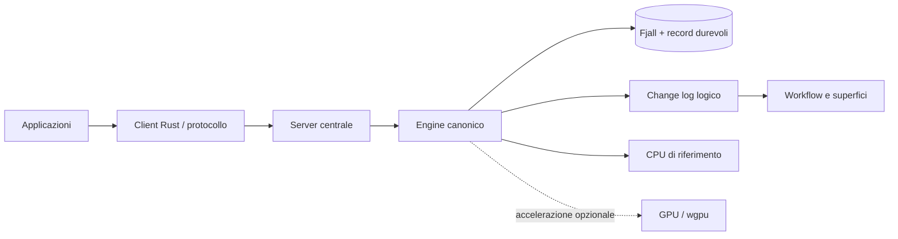
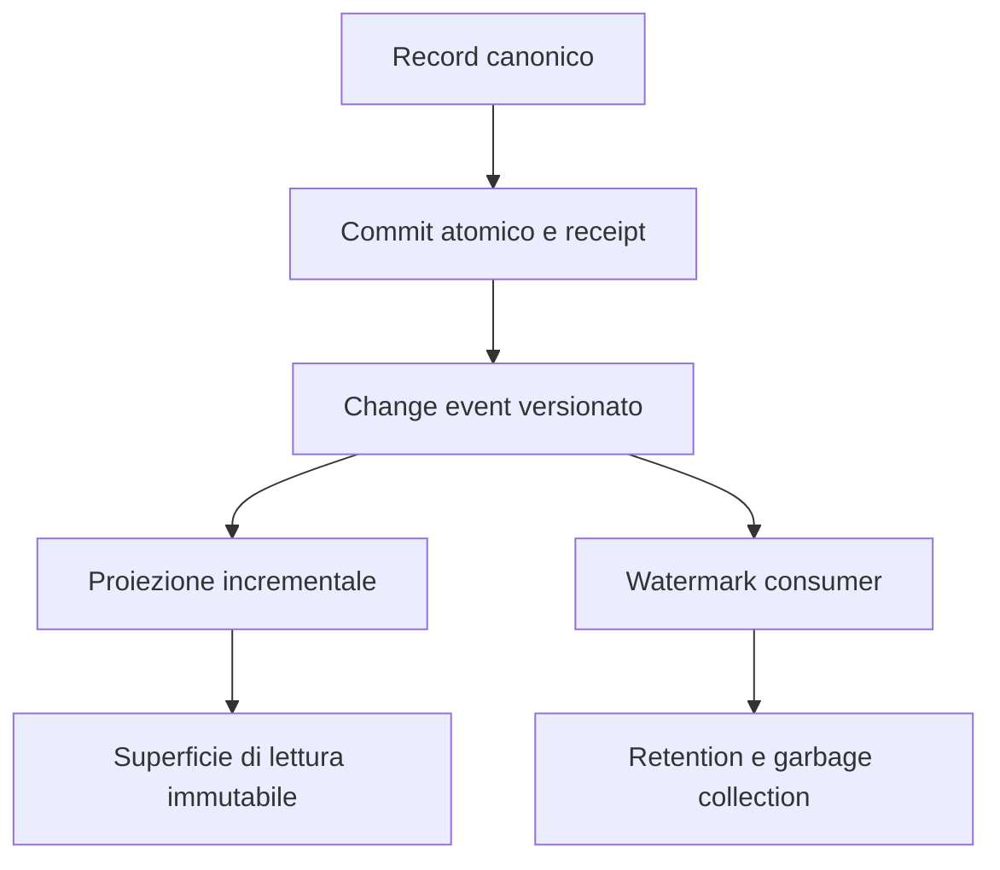

# AProDB

[](https://github.com/provenzali/aprodb/actions/workflows/cpu-ci.yml)
[](LICENSING.md)
[](LICENSING.md)

> [!WARNING]
> **Stato: beta test.** AProDB è disponibile per valutazione, sviluppo e
> collaudo, ma non è ancora production-ready. Formati e API 1.x possono
> richiedere migrazioni esplicite prima della prima release stabile.

AProDB (*Adaptive Parallel Object Database*) è un database sperimentale scritto in Rust. Il repository contiene il prototipo embedded 0.1 e, separatamente, il nuovo motore canonico 1.x descritto in [paper.md](paper.md).

## In breve

AProDB conserva dati canonici durevoli e mantiene attorno a essi workflow,
change stream, proiezioni e superfici incrementali. La CPU definisce la
semantica di riferimento; una GPU opzionale può accelerare operatori batch e
ricerca vettoriale esatta senza diventare una dipendenza dello storage. Leggi
l'[abstract bilingue](ABSTRACT.md), la [specifica tecnica](paper.md) e il
[manuale delle funzioni realmente disponibili](manual.md).





## Stato del progetto

- La CLI e l'API alla radice restano il prototipo 0.1 single-process.
- `aprodb::v1` espone la verticale Milestone 1: storage Fjall, tipi e formati
  logici versionati, lock esclusivo, change log atomico, Durable/Relaxed,
  Put/Get/Delete/CAS/AtomicBatch, checkpoint logico, retention e recovery.
- La Milestone 2 aggiunge daemon centrale, protocollo Protobuf limitato, TCP e
  named pipe/Unix socket, client Rust async/bloccante, auth data/admin,
  backpressure, metriche e CLI amministrativa.
- La Milestone 3 aggiunge budget memoria effettivo, cache separate e limitate,
  TTL indicizzato, descrittori e policy radiali persistenti, storage class
  logiche ed `ExplainPlacement`. Il tiering fisico non è dichiarato da Fjall.
- La Milestone 4 aggiunge idempotenza persistente, workflow at-least-once con
  lease e fencing, change stream paginato e superfici work/read incrementali,
  generazionali e ricostruibili. Protocollo, client e test TCP coprono l'intera
  verticale.
- La Milestone 5 aggiunge frame canonici Raw/Zstandard adattivi per tier,
  content-type skip, pool/scratch limitati, dizionari versionati e validati,
  cache compressa/decompressa separate, API admin e matrice misurata a quattro
  modalità.
- La Milestone 6 aggiunge vector exact/top-k CPU, layout colonnare, scheduler a
  costo limitato, backend wgpu opzionale, cache VRAM ricostruibile, fallback e
  metriche.
- La Milestone 7 aggiunge backup/restore verificato, verify e repair su copia,
  TLS/mTLS, cifratura at-rest e rekey copy-only, audit Durable, quote tenant e
  disco, strumenti operativi e import one-shot 0.1. Le funzioni 1.x restano
  sperimentali e non equivalgono a una release production-ready.

## Avvio rapido del prototipo 0.1

```powershell
cargo build --release
cargo run --release -- put saluto "ciao mondo"
cargo run --release -- get saluto
cargo run --release -- put vettore "1,0,0" --kind vector
cargo run --release -- vector-search "0.9,0.1,0" --backend auto
cargo run --release -- stats
```

Demo/mini-benchmark con dati vettoriali:

```powershell
cargo run --release -- --relaxed demo --items 10000 --dimension 128 --backend auto
cargo bench --bench throughput
```

Solo CPU:

```powershell
cargo build --release --no-default-features
```

## Avvio rapido del server 1.x sperimentale

Imposta due token distinti di almeno 16 byte senza passarli nella riga di
comando, quindi avvia il daemon:

```powershell
$env:APRODB_DATA_TOKEN = "sostituire-token-data"
$env:APRODB_ADMIN_TOKEN = "sostituire-token-admin"
cargo run -p aprodb-server -- --data-dir .\aprodb-data --backup-root .\aprodb-backups
```

Da un secondo terminale con il solo token amministrativo:

```powershell
$env:APRODB_ADMIN_TOKEN = "sostituire-token-admin"
cargo run -p aprodb-cli -- health
cargo run -p aprodb-cli -- stats
cargo run -p aprodb-cli -- cache-stats
cargo run -p aprodb-cli -- compression-stats
cargo run -p aprodb-cli -- compute-stats
cargo run -p aprodb-cli -- audit - 100
cargo run -p aprodb-cli -- backup daily-001
cargo run -p aprodb-cli -- compression-policy tenant namespace objects
cargo run -p aprodb-cli -- set-compression tenant namespace objects zstd
cargo run -p aprodb-cli -- expire
cargo run -p aprodb-cli -- create-surface pending-work work tenant namespace jobs pending records 1000 8388608 2
cargo run -p aprodb-cli -- build-surface pending-work 4096
cargo run -p aprodb-cli -- shutdown
```

Gli endpoint predefiniti sono `127.0.0.1:7643` per i dati e
`127.0.0.1:7644` per l'amministrazione. L'API dati 1.x è esposta dal crate
`aprodb-client`; configurazione, semantica e limiti sono nel manuale.
Il server usa wgpu con le feature predefinite e resta CPU-completo con
`cargo run -p aprodb-server --no-default-features -- --data-dir .\aprodb-data`.
Per abilitare backup online serve `--backup-root`; TLS usa
`--tls-cert`/`--tls-key` e l'eventuale `--tls-client-ca`. Keyring, quote e limiti
disco sono file/opzioni espliciti descritti nel manuale.

Le operazioni che devono mantenere intatta la sorgente sono offline e copy-only:

```powershell
cargo run -p aprodb-cli --bin aprodb-ops -- verify .\aprodb-data
cargo run -p aprodb-cli --bin aprodb-ops -- verify-backup .\backups\daily-001
cargo run -p aprodb-cli --bin aprodb-ops -- restore .\backups\daily-001 .\restored
cargo run -p aprodb-cli --bin aprodb-ops -- import-0.1 .\legacy .\legacy-copy .\aprodb-1 tenant namespace collection partition
```

## Cosa implementa il prototipo 0.1

- working set in RAM suddiviso in shard concorrenti;
- WAL append-only con CRC32, sequenze e recupero di code incomplete;
- snapshot consistenti;
- compressione adattiva Zstandard su RAM, WAL e snapshot, parallelizzata per canale;
- operazioni e scansioni batch con Rayon;
- valori bytes, testo, `i64`, `f64` e vettori `f32`;
- dot product e cosine similarity con shader WGSL via `wgpu`;
- selezione automatica CPU/GPU e fallback sicuro;
- API Rust, CLI JSON e test end-to-end.

Consulta [manual.md](manual.md) per il manuale e [diary.md](diary.md) per le decisioni implementative.

## Licenze, autore e contributi

AProDB è stato concepito e avviato da **Andrea Provenzali**
([ORCID 0009-0009-9677-9840](https://orcid.org/0009-0009-9677-9840),
[@provenzali](https://github.com/provenzali)). Copyright © 2026 Andrea
Provenzali e contributori AProDB.

Il core del database, il server, storage, engine, compute, CLI e facade sono
distribuiti sotto **GNU AGPL-3.0-only**. Il client Rust, il protocollo e i tipi
pubblici d'integrazione sono distribuiti separatamente sotto **Apache-2.0**.
Questa separazione permette di collegare applicazioni con licenze differenti
senza offrire il core sotto una licenza permissiva. La mappa normativa completa
è in [LICENSING.md](LICENSING.md); origine e citazione sono in [NOTICE](NOTICE),
[AUTHORS.md](AUTHORS.md) e [CITATION.cff](CITATION.cff).
Le licenze dichiarate dalle dipendenze bloccate sono inventariate in
[THIRD_PARTY_LICENSES.md](THIRD_PARTY_LICENSES.md).

OpenAI Codex è stato usato come assistente di sviluppo sotto direzione e
revisione umana. Questa informazione non cambia paternità o licenze; dettagli e
valutazione corrente dell'EU AI Act sono in
[AI_ASSISTANCE.md](AI_ASSISTANCE.md).

Per contribuire consulta [CONTRIBUTING.md](CONTRIBUTING.md). Le vulnerabilità
devono essere segnalate privatamente secondo [SECURITY.md](SECURITY.md).

## Confini attuali

La versione 0.1 è single-node/single-process e non offre SQL, rete, replica,
transazioni multi-chiave o autenticazione. Il percorso 1.x è anch'esso
sperimentale e non va considerato production-ready: il tiering fisico,
ANN e gli altri operatori GPU, KMS, restore online, RBAC fine-grained, metric
exporter e replica sono ancora aperti. Backup/restore, TLS, cifratura at-rest e
audit sono implementati ma richiedono audit operativo e test periodici prima di
un uso production. La compressione 1.x è implementata ma il tuning production e il garbage
collection dei dizionari restano aperti. Le superfici attuali supportano una sorgente, filtro
per stato workflow e output record/JSON; trasformazioni dichiarative più ampie
non sono ancora disponibili. Lo stato
requisito per requisito è in
[docs/requirements-matrix.md](docs/requirements-matrix.md).
