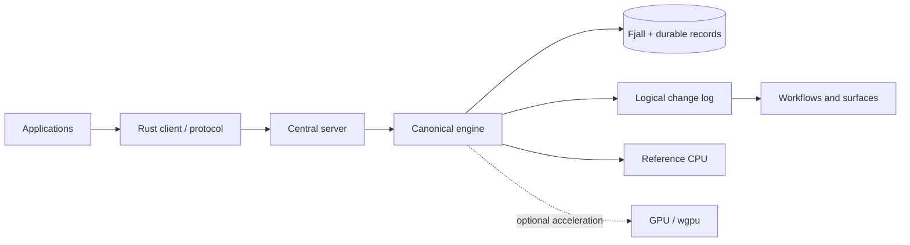
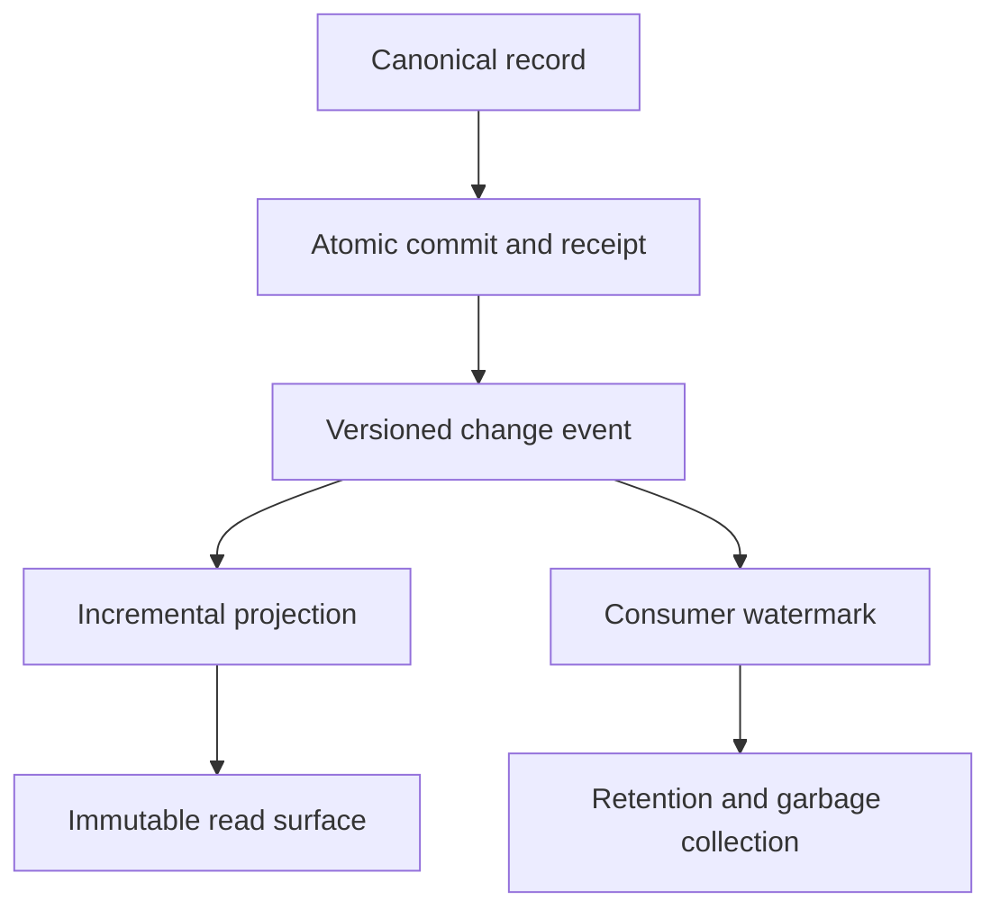

# AProDB

[](https://github.com/provenzali/aprodb/actions/workflows/cpu-ci.yml)
[](LICENSING.md)
[](LICENSING.md)

> [!WARNING]
> **Status: beta.** AProDB is available for evaluation, development,
> and testing, but it is not production-ready. The 1.x formats and APIs may
> require explicit migrations before the first stable release.

AProDB (*Adaptive Parallel Object Database*) is an experimental database written in Rust. This repository contains the embedded 0.1 prototype as well as the new canonical 1.x engine described in [paper.md](paper.md).

## At a glance

AProDB stores durable canonical data and maintains workflows, change streams,
projections, and incremental surfaces around it. The CPU defines the reference
semantics; an optional GPU can accelerate batch operators and exact vector
search without becoming a storage dependency. Read the [abstract](ABSTRACT.md),
the [technical specification](paper.md), and the [manual for features that are
actually available](manual.md).





## Project status

- The root CLI and API remain the single-process 0.1 prototype.
- `aprodb::v1` exposes the Milestone 1 vertical slice: Fjall storage,
  versioned logical types and formats, exclusive locking, atomic change log,
  Durable/Relaxed modes, Put/Get/Delete/CAS/AtomicBatch, logical checkpoints,
  retention, and recovery.
- Milestone 2 adds a central daemon, bounded Protobuf protocol, TCP and named
  pipe/Unix socket transports, async/blocking Rust clients, data/admin
  authentication, backpressure, metrics, and an administrative CLI.
- Milestone 3 adds an enforced memory budget, separate bounded caches, indexed
  TTL, persistent radial descriptors and policies, logical storage classes,
  and `ExplainPlacement`. Fjall does not expose physical tiering.
- Milestone 4 adds persistent idempotency, at-least-once workflows with leases
  and fencing, a paginated change stream, and incremental, generational,
  rebuildable work/read surfaces. Protocol, client, and TCP tests cover the
  complete vertical slice.
- Milestone 5 adds adaptive canonical Raw/Zstandard frames by tier,
  content-type skipping, bounded pools/scratch space, versioned validated
  dictionaries, separate compressed/decompressed caches, an admin API, and a
  measured four-mode matrix.
- Milestone 6 adds exact/top-k CPU vector operations, columnar layouts, a
  bounded cost scheduler, an optional wgpu backend, rebuildable VRAM cache,
  fallback, and metrics.
- Milestone 7 adds verified backup/restore, verify and copy-based repair,
  TLS/mTLS, at-rest encryption and copy-only rekey, Durable audit records,
  tenant and disk quotas, operational tools, and one-shot 0.1 import. The 1.x
  features remain experimental and do not amount to a production-ready release.

## Quick start: 0.1 prototype

```powershell
cargo build --release
cargo run --release -- put greeting "hello world"
cargo run --release -- get greeting
cargo run --release -- put vector "1,0,0" --kind vector
cargo run --release -- vector-search "0.9,0.1,0" --backend auto
cargo run --release -- stats
```

Demo/microbenchmark with vector data:

```powershell
cargo run --release -- --relaxed demo --items 10000 --dimension 128 --backend auto
cargo bench --bench throughput
```

CPU only:

```powershell
cargo build --release --no-default-features
```

## Quick start: experimental 1.x server

Set two different tokens of at least 16 bytes, without placing them on the command line, then start the daemon:

```powershell
$env:APRODB_DATA_TOKEN = "replace-data-token"
$env:APRODB_ADMIN_TOKEN = "replace-admin-token"
cargo run -p aprodb-server -- --data-dir .\aprodb-data --backup-root .\aprodb-backups
```

From a second terminal with only the administrative token:

```powershell
$env:APRODB_ADMIN_TOKEN = "replace-admin-token"
cargo run -p aprodb-cli -- health
cargo run -p aprodb-cli -- stats
cargo run -p aprodb-cli -- cache-stats
cargo run -p aprodb-cli -- compression-stats
cargo run -p aprodb-cli -- compute-stats
cargo run -p aprodb-cli -- audit - 100
cargo run -p aprodb-cli -- backup daily-001
cargo run -p aprodb-cli -- compression-policy tenant namespace objects
cargo run -p aprodb-cli -- set-compression tenant namespace objects zstd
cargo run -p aprodb-cli -- expire
cargo run -p aprodb-cli -- create-surface pending-work work tenant namespace jobs pending records 1000 8388608 2
cargo run -p aprodb-cli -- build-surface pending-work 4096
cargo run -p aprodb-cli -- shutdown
```

The default endpoints are `127.0.0.1:7643` for data and `127.0.0.1:7644` for administration. The 1.x data API is exposed by the `aprodb-client` crate; configuration, semantics, and limits are documented in the manual. With default features the server uses wgpu, while remaining CPU-only with `cargo run -p aprodb-server --no-default-features -- --data-dir .\aprodb-data`. Online backup requires `--backup-root`; TLS uses `--tls-cert`/`--tls-key` and the optional `--tls-client-ca`. Keyrings, quotas, and disk limits are explicit files/options described in the manual.

Operations that must leave the source unchanged are offline and copy-only:

```powershell
cargo run -p aprodb-cli --bin aprodb-ops -- verify .\aprodb-data
cargo run -p aprodb-cli --bin aprodb-ops -- verify-backup .\backups\daily-001
cargo run -p aprodb-cli --bin aprodb-ops -- restore .\backups\daily-001 .\restored
cargo run -p aprodb-cli --bin aprodb-ops -- import-0.1 .\legacy .\legacy-copy .\aprodb-1 tenant namespace collection partition
```

A bounded PostgreSQL-to-AProDB validation importer is also available in public beta. It publishes a new data directory only after a complete stream and two successful verification passes. Read its [scope, safety model, mapping, and limitations](docs/postgresql-import.md) before using it against a live server.

The comparative benchmark is kept outside the main dependency graph and currently covers AProDB,
SQLite, PostgreSQL, MySQL, MariaDB, and Redis/Valkey. Results must state durability settings and
the embedded-vs-loopback boundary; see [benchmarks/comparative](benchmarks/comparative).

## What the 0.1 prototype implements

- an in-memory working set split into concurrent shards;
- an append-only WAL with CRC32, sequences, and truncated-tail recovery;
- consistent snapshots;
- adaptive Zstandard compression for RAM, WAL, and snapshots, parallelized by channel;
- Rayon batch operations and scans;
- byte, text, `i64`, `f64`, and `f32` vector values;
- dot product and cosine similarity through WGSL shaders and `wgpu`;
- automatic CPU/GPU selection and safe fallback;
- Rust API, JSON CLI, and end-to-end tests.

See [manual.md](manual.md) for the manual and [diary.md](diary.md) for implementation decisions.

## Licenses, author, and contributions

AProDB was conceived and initiated by **Andrea Provenzali** ([ORCID 0009-0009-9677-9840](https://orcid.org/0009-0009-9677-9840), [@provenzali](https://github.com/provenzali)). Copyright © 2026 Andrea Provenzali and AProDB contributors.

The database core, server, storage, engine, compute layer, CLI, and facade are distributed under **GNU AGPL-3.0-only**. The Rust client, protocol, and public integration types are distributed separately under **Apache-2.0**. This split allows applications under different licenses to connect without making the core permissively licensed. The complete normative map is in [LICENSING.md](LICENSING.md); provenance and citation are in [NOTICE](NOTICE), [AUTHORS.md](AUTHORS.md), and [CITATION.cff](CITATION.cff). Licenses declared by locked dependencies are inventoried in [THIRD_PARTY_LICENSES.md](THIRD_PARTY_LICENSES.md).

OpenAI Codex was used as a development assistant under human direction and review. This does not change authorship or licensing; details and the current EU AI Act assessment are in [AI_ASSISTANCE.md](AI_ASSISTANCE.md).

See [CONTRIBUTING.md](CONTRIBUTING.md) to contribute. Report vulnerabilities privately according to [SECURITY.md](SECURITY.md).

## Current boundaries

Version 0.1 is single-node/single-process and does not provide SQL, networking, replication, multi-key transactions, or authentication. The 1.x path is also experimental and must not be treated as production-ready: physical tiering, ANN and other GPU operators, KMS, online restore, fine-grained RBAC, a metrics exporter, and replication remain open. Backup/restore, TLS, at-rest encryption, and auditing are implemented but require an operational audit and periodic testing before production use. The 1.x compression path is implemented, but production tuning and dictionary garbage collection remain open. Current surfaces support one source, workflow-state filters, and record/JSON output; broader declarative transformations are not yet available. Requirement-level status is tracked in [docs/requirements-matrix.md](docs/requirements-matrix.md).
